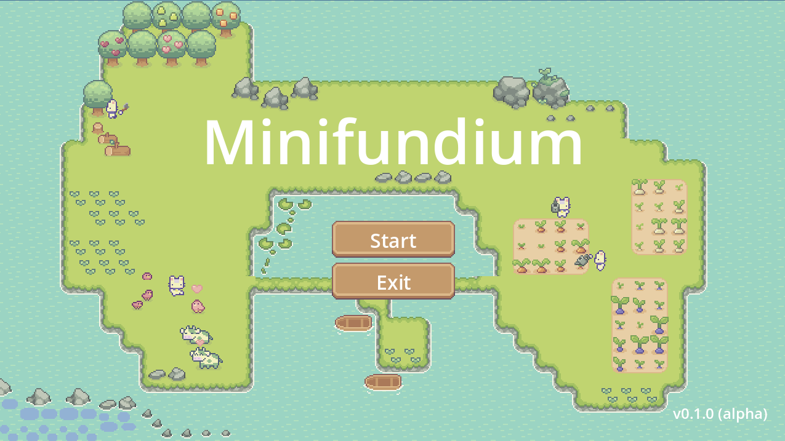
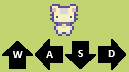

## 📖 About Minifundium



Minifundium is a cozy agricultural simulation and management game developed in Godot Engine. The name comes from the Latinized Spanish word "minifundio," which refers to a very small farming estate.

Here is what you can expect from the game:

* **Start Small:** You begin your journey with a humble, limited plot of land—a true "minifundium".
* **Farm and Manage:** Experience a satisfying gameplay loop: till the soil, plant seeds, water them, wait for the crops to mature, and harvest them for rewards.
* **Intelligent Helpers:** Unlike traditional farming games with static characters, Minifundium features non-playable characters (NPCs), like chickens, powered by Reactive Artificial Intelligence and Reinforcement Learning. These AI assistants actually learn from your commands and adapt to your playstyle to help automate farm tasks!
* **Relaxing Experience:** Designed as a "cozy game," it promotes planning and patience over stress, offering a relaxing environment without urgent penalties or violence.

---

## 📸 Screenshots



---

## 🚀 Installation & Running the Game

You can play Minifundium by downloading the pre-compiled executable or by running the source code directly through the Godot Engine.

### System Requirements

* **OS:** Windows 10 or 11 (64-bit)
* **RAM:** 4 GB
* **Graphics:** OpenGL 3.3 or Vulkan compatible

### Method 1: Playable Build (.exe)

1. Navigate to the **Releases** tab on the right side of this GitHub repository.
2. Download the latest `.zip` file containing the Windows build.
3. Extract the contents of the `.zip` file to an empty folder on your computer.
4. Double-click `Minifundium.exe` to start playing!

### Method 2: Running from Source Code (Godot Engine)

If you want to explore the code, test the AI laboratories, or modify the game, you can open the project directly in Godot.

1. **Download Godot:** Ensure you have Godot Engine (Version 4.6) installed. You can download it for free from [godotengine.org](https://godotengine.org).
2. **Clone the Repository:** 
   * Clone this repository using Git: 
     ```bash
     git clone https://github.com/llerandi/minifundium.git
     ```
   * Alternatively, click the green **Code** button at the top of this page and select **Download ZIP**, then extract it.
3. **Import to Godot:**
   * Open the Godot Engine.
   * Click on the **Import** button in the Project Manager.
   * Navigate to the folder where you cloned or extracted the repository and select the `project.godot` file.
   * Click **Import & Edit**.
4. **Play:** Press `F5` or click the **Play** button in the top right corner of the Godot editor to launch the game.