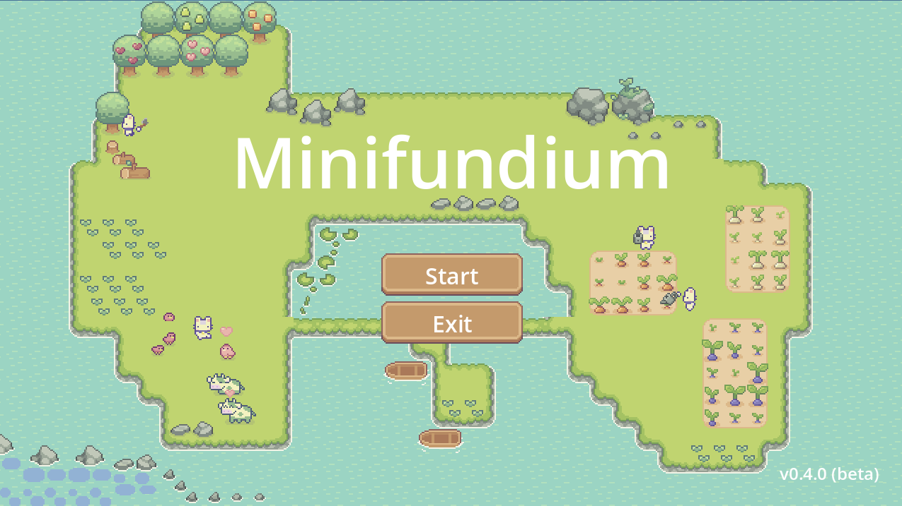
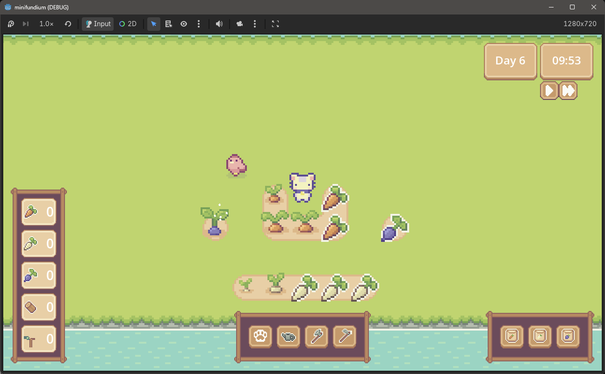
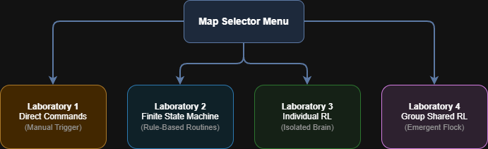

# Minifundium

### An AI-Driven Agriculture Simulation and Intelligent NPC Laboratory in Godot 4

[](https://godotengine.org)
[](https://creativecommons.org/licenses/by-nc-nd/3.0/)
[](#)

Minifundium is a cozy agricultural simulation and behavioral AI testing ground developed in Godot Engine 4. The project redefines standard Non-Player Character (NPC) behaviors in management games —where characters traditionally adhere to static, pre - calcula ted routine loops —by introducing dynamic, adaptive helpers powered by native **Tabular Reinforcement Learning**.

The name comes from the Latinized Spanish word *"minifundio"*, which refers to a very small farming plot.

## Guided Visual Tour & Gameplay

### 1. Title Screen & Main Menu
*The entryway to the game, featuring the layout selector menu where you can access the sandbox or step into individual research environments.*



### 2. Core Agriculture Loops (Tilling & Planting)
*Equip tools using the hotbar UI. Walk near standard grass tiles, use the Hoe to till the soil, select seeds (Carrot, Turnip, Beet), plant them, and activate the growth cycle using your Watering Can.*

### 3. The Autonomous Helper at Work
*Once trained, chickens scan the tree hierarchy for fully-grown crop nodes, navigate across the tilemap region using Godot's built-in `NavigationAgent2D`, play a harvest action, and deliver resources directly to the player's UI inventory counters.*




## The AI Laboratory Architecture

Minifundium functions as an experimental sandbox split into distinct layouts (Laboratories). This structure isolates and compares deterministic behaviors against adaptive learning models.



1. **Lab 1 (Directly Commanded):** The baseline control framework. NPCs remain in an `Idle` state until the player explicitly signals a directive using the contextual action hotkey (`R`).
2. **Lab 2 (Finite State Machine - FSM):** Traditional reactive AI. The chicken autonomously transitions based on immediate hard-coded queries (e.g., *Is there a crop ready? Yes ➔ Route to it; No ➔ Select a random path point and stroll*).
3. **Lab 3 (Individual Reinforcement Learning):** Introduces a light, tabular Q-Learning analogue built from scratch in GDScript. The agent builds an isolated transition matrix over time, leaning heavily toward autonomous field work after receiving manual reinforcement from the player.
4. **Lab 4 (Group Reinforcement Learning):** Multi-agent collective intelligence.
Multiple chickens interface with a unified autoloaded global matrix. Knowledge acquired by a single helper immediately optimizes the behavior vector of the entire flock.


## Deep Dive: How the Native RL Matrix Works

To avoid resource -heavy external dependencies, sockets, or complex Python wrappers (like MLAgents), Minifundium houses its weight -based transition logic natively inside lightweight GDScript components (`brain_rl.gd`).

### 1. The Weight -Based Matrix State
Each RL brain contains a structured dictionary mapping current conditions to historical selection weights. Initially, the paths for `Idle` vs. `Harvest` choices are perfectly balanced:

```gdscript
var matrix = {
   "Idle": {"Idle": 1, "Harvest": 1},
   "Harvest": {"Idle": 1, "Harvest": 1}
}
```

### 2. Rewarding the System
When a crop matures and the player gives a direct execution harvest command (R Key), the chicken tracks its past status and increments the priority of that selection inside its row:

```gdscript
func on_player_command() -> void:
	var crop = chicken.find_ready_crop()
	if crop:
		matrix[last_state]["Harvest"] += 1

		chicken.target_crop = crop
		last_state = "Harvest"
		chicken.state.transition_to("Movement")
```

### 3. Choosing Actions via Weighted Selection
When an action ends, the brain queries the row corresponding to its last_state and executes an action selection algorithm based on a randomized wheel approach:

```gdscript
func _choose_weighted_action() -> String:
	var choices = matrix[last_state]
	var total_weight = 0
	
	# Sum the weights in the corresponding row
	for w in choices.values():
		total_weight += w
	
	var random_val = randi() % total_weight
	var current_sum = 0
	
	for state in choices.keys():
		current_sum += choices[state]
		if random_val < current_sum:
			return state
	
	return "Idle"
```

As the player repeatedly rewards harvesting behavior, the  statistical scale shifts heavily towards farm chores, turning an aimless wanderer into a proactive helper.

## Technical Specifications & System Architecture
Minifundium is fully modular, dividing behaviors into decoupled nodes following clean game design patterns.

* **Godot 4.6 Engine Features**: Built using the Forward Plus rendering
backend, making full use of the new TileMapLayer nodes for separate layout mapping (Water, Grass, Ground, Tilled Dirt).
* **Decoupled States**: Implements a strict State Pattern. States like Harvest, Idle, and Movement emit transition requests back to a StateMachine arbiter.
* **Component-Driven Entities**: Items interact through typed areas (Hitbox and Hurtbox layers) allowing explicit tool validation (e.g., the Tree sprite node only registers damage calculations when overlapping a hitbox where current_tool == DataTypes.Tool.AXE).
* **Autoload managers** (Singletons):
   * **GameTime**: Manages cycles using internal mathematical scaling (TAU / (60 * 24)), driving the growth ticks of vegetable nodes.
   * **Resources**: Centralizes global item counts for carrots, turnips, beets, saplings, and logs.
   * **GlobalAi**: Hosts the shared flock matrices utilized by Lab 4.

## Art & Visual Assets Credits

The high -quality visual assets, character spritesheets, and environment tiles used in Minifundium were officially sourced from Sprout Lands by Cup Nooble via itch.io.

* License Status: Fully licensed. The Premium Version of the assets was purchased to support the original creator and to access extended tilesets, tool animations, and animal spritesheets (including the chickens, cows, and advanced agricultural packages utilized throughout the laboratory levels).
* Direct File Usage Reference (assets/game/):
   * premium_character_spritesheet.png: Employed for advanced tilling, watering, and woodcutting player animation states.
   * red_chicken_spritesheet.png & green_cow_spritesheet.png: Integrated to drive the entity behavioral and laboratory AI simulations.
   * tilled_tiles.png & water_objects_spritesheet.png: Bound to the
layered, interactive tilemap grid layout.
* Creator Profile: Cup Nooble on itch.io

***Note**: These assets are bundled strictly for the evaluation and execution of this academic project. Redistribution, extraction, or commercial reuse of these graphics outside of this repository is strictly prohibited under the creator's original asset license.*

## License and Academic Disclaimer

The code elements and source assets are released under the **Attribution-NonCommercial-NoDerivs 3.0 Unported (CC BY-NC-ND 3.0)** public license terms. Commercial exploitation or redistribution of altered assets is strictly forbidden without express authorization.

## System Requirements & Deployment

### Hardware Requirements
* **OS**: Windows 10 / 11 (64 -bit)
* **Memory**: 4 GB RAM
* **Graphics**: Compatibility with Vulkan or OpenGL 3.3 standards.

#### Method 1: Running the Pre - compiled Binary
1. Go to the Releases tab on the right sidebar of this repository.
2. Download the latest release .zip bundle for Windows.
3. Extract the assets into an empty directory.
4. Run Minifundium.exe.

#### Method 2: Sourcing from Code (Godot Editor)
1. **Engine Setup**: Install Godot Engine 4.6 (Standard Edition) from the official website.
2. **Clone Repository**:

```bash
git clone https://github.com/llerandi/minifundium.git
```
3. **Import Project**:
    * Open the Godot Project Manager.
    * Click Import, navigate to your cloned path, and pick the project.godot file.
    * Hit Import & Edit.
4. **Execution**: Press F5 to open the runtime thread from the editor.

## Keybindings & Controls

| Control | Action Context |
| :--- | :--- |
| **W, A, S, D** | Character Movement (Up, Left, Down, Right) |
| **Left Click** | Select hotbar items ➔ Use active tool (Hoe ground, plant seed, water crop, chop tree) |
| **Right Click** | While holding a Hoe ➔ Revert tilled soil back to standard grass tile |
| **Right Click** | While holding a Watering Can ➔ Delete/Clear target crop instance |
| **R Key** | Issues a direct harvest command to the active NPC agent (Triggers the learning function) |
| **UI Toggles** | Top Right Buttons: Speed up time processing (x1 normal or x2 fast growth testing) |